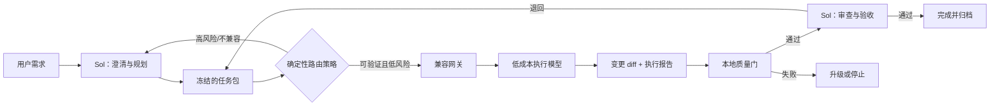

# 01｜参考架构

## 选择：保持 Codex Desktop，但使用确定性桥接

未来推荐路径是：Codex Desktop 中的 Sol 作为主会话和最终审查者；一个可审计的本地工作流负责将合格任务交给外部执行通道（例如受控的 `codex exec` 配置或等价桥接），该通道再通过兼容网关请求候选国内模型。

不能把正确性押在“Sol 原生自动委派一定会调用指定执行模型”上。当前产品版本与模型角色选择会变化；因此选路、权限、状态和日志应由确定性控制层执行。Sol 可以提出计划，但不能单独作为路由器是否真的按计划执行的证据。

## 组件边界

### Codex Desktop / Sol

保留用户会话、计划、关键决策、架构审查和最终验收。Sol 的访问次数仍会消耗相应额度；方案通过减少它参与例行实现和重复调试的回合数来节省，而不是使其“免费”。

### 确定性控制层

实现前可选择 Codex skill/plugin 或一个受控脚本入口，但它必须具备：阶段状态机、策略判断、任务包生成、最小权限调用、日志写入、失败关闭和恢复点。它不应在没有记录的情况下替换模型或扩大权限。

### 兼容网关与提供商

网关把执行请求转为候选提供商能接受的协议，并保留真实提供商/模型/请求 ID/用量/错误信息。任何 API 兼容性必须以实测为准，不能只看“OpenAI-compatible”宣传。

### 项目内持久状态

未来在被实施项目中创建 `.ai/`（可按项目调整），至少包括 `task-state.json`、`task-packet.json`、`acceptance.md`、`run-report.json` 与受脱敏保护的运行索引。此仓库只给出示例，不存用户项目状态。

## 为什么不是直接全自动 subagent

原生自动委派受版本、模型、角色配置和运行时策略影响。即使页面上显示了一个代理角色，也不等于它必然使用了预期的外部模型。因此自动化的可信来源应是显式触发、路由日志、调用记录和文件变更归属，而不是 UI 猜测或模型说“我已委派”。
